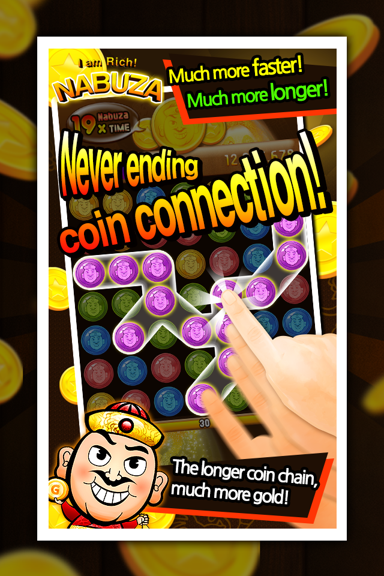

# Traditional puzzle game for cocos2dx

This game had served for a long time, but it shut down. Finally, the source codes have been made open. The code can be used to create any puzzle game.

## Installation

```sh
git clone https://github.com/cable8mm/nabuza-i.git

cd nabuza-i
```

Then build it. That's all.

## Coding style

```sh
find . -name \* -print0 | xargs -0 -n1 clang-format -i
```

## Preview




## License

The Nabuza project is open-sourced software licensed under the [MIT license](https://opensource.org/licenses/MIT).
